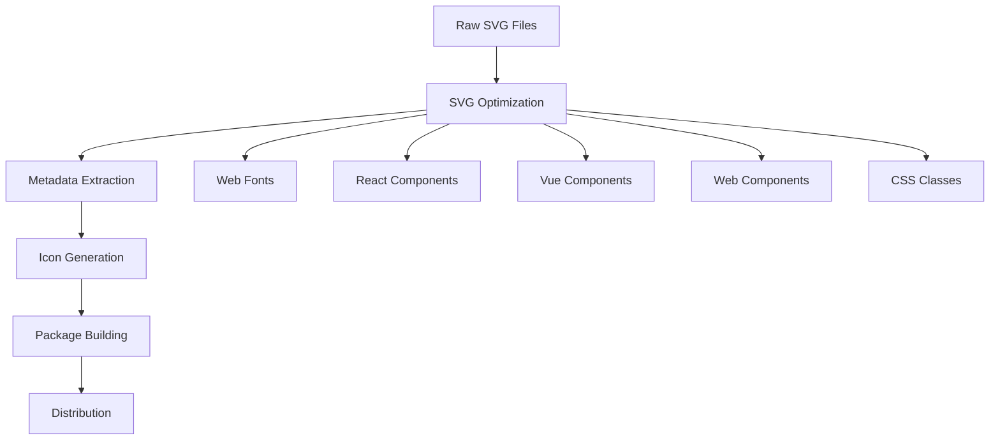

# Philippine Government Icons Library - Architecture Document

## Overview

This document outlines the architecture for a comprehensive library of Philippine government icons, designed to be used by developers similar to FontAwesome. The library will provide easy-to-use, scalable vector icons representing various Philippine government agencies, departments, and official symbols.

## Project Goals

- **Comprehensive Coverage**: Include icons for all major Philippine government agencies, departments, and official symbols
- **Developer-Friendly**: Provide multiple integration methods (CSS, SVG, React, Vue, etc.)
- **Performance**: Optimized for web performance with tree-shaking support
- **Accessibility**: Ensure all icons meet accessibility standards
- **Maintainability**: Easy to add new icons and update existing ones
- **Documentation**: Comprehensive documentation with live examples

## Project Structure

```
better-gov-logos/
├── docs/                          # Documentation
│   ├── api/                       # API documentation
│   ├── examples/                  # Usage examples
│   └── icons/                     # Icon documentation
├── packages/                      # Multi-package structure
│   ├── core/                      # Core icon definitions
│   │   ├── icons/                 # SVG icon files
│   │   │   ├── executive/         # Executive branch icons
│   │   │   ├── legislative/       # Legislative branch icons
│   │   │   ├── judicial/          # Judicial branch icons
│   │   │   ├── constitutional/    # Constitutional bodies
│   │   │   └── local/             # Local government units
│   │   ├── metadata/              # Icon metadata
│   │   └── build/                 # Build scripts
│   ├── css/                       # CSS package
│   ├── react/                     # React components
│   ├── vue/                       # Vue components
│   ├── angular/                   # Angular components
│   ├── svelte/                    # Svelte components
│   └── web-components/            # Web Components
├── tools/                         # Build and development tools
│   ├── icon-optimizer/            # SVG optimization
│   ├── font-generator/            # Web font generation
│   └── build-scripts/             # Build automation
├── tests/                         # Test suites
├── examples/                      # Example implementations
└── dist/                          # Distribution files
```

## Icon Categories

### 1. Executive Branch
- **Office of the President**
  - Malacañang Palace
  - Presidential Seal
  - Office of the President Logo
- **Cabinet Departments**
  - Department of Education (DepEd)
  - Department of Health (DOH)
  - Department of Transportation (DOTr)
  - Department of Public Works and Highways (DPWH)
  - Department of Agriculture (DA)
  - Department of Trade and Industry (DTI)
  - Department of Labor and Employment (DOLE)
  - Department of Social Welfare and Development (DSWD)
  - Department of Interior and Local Government (DILG)
  - Department of National Defense (DND)
  - Department of Finance (DOF)
  - Department of Justice (DOJ)
  - Department of Environment and Natural Resources (DENR)
  - Department of Energy (DOE)
  - Department of Tourism (DOT)
  - Department of Science and Technology (DOST)
  - Department of Information and Communications Technology (DICT)
  - Department of Foreign Affairs (DFA)
  - Department of Budget and Management (DBM)
  - Department of Agrarian Reform (DAR)

### 2. Legislative Branch
- **Congress of the Philippines**
  - Senate Seal
  - House of Representatives Seal
  - Congressional Logo
- **Legislative Committees**
  - Various committee logos

### 3. Judicial Branch
- **Supreme Court**
  - Supreme Court Seal
  - Court of Appeals
  - Regional Trial Courts
  - Municipal Trial Courts

### 4. Constitutional Bodies
- **Commission on Elections (COMELEC)**
- **Commission on Audit (COA)**
- **Civil Service Commission (CSC)**
- **Commission on Human Rights (CHR)**

### 5. Local Government Units
- **Provinces** (81 provinces)
- **Cities** (Major cities)
- **Municipalities** (Key municipalities)
- **Barangays** (Generic barangay symbol)

### 6. Government-Owned and Controlled Corporations (GOCCs)
- **Philippine Airlines (PAL)**
- **Manila Water**
- **Maynilad**
- **Metro Manila Development Authority (MMDA)**
- **Philippine National Police (PNP)**
- **Armed Forces of the Philippines (AFP)**

## Technical Architecture

### 1. Core Package (`@ph-gov-icons/core`)

**Purpose**: Contains the raw SVG icons and metadata

**Structure**:
```typescript
interface IconMetadata {
  name: string;
  category: string;
  tags: string[];
  description: string;
  keywords: string[];
  version: string;
  author: string;
  license: string;
  viewBox: string;
  width: number;
  height: number;
  path: string;
}
```

**Features**:
- Raw SVG files in organized folders
- JSON metadata for each icon
- TypeScript definitions
- Build scripts for optimization

### 2. CSS Package (`@ph-gov-icons/css`)

**Purpose**: CSS-based icon library similar to FontAwesome

**Features**:
- Web fonts (WOFF2, WOFF, TTF)
- CSS classes (`.ph-icon-ph-flag`, `.ph-icon-malacanang`)
- CSS custom properties for theming
- Responsive sizing utilities

**Usage**:
```css
@import '@ph-gov-icons/css/ph-gov-icons.css';

.ph-icon-ph-flag {
  font-family: 'Philippine Government Icons';
  font-size: 24px;
}
```

### 3. React Package (`@ph-gov-icons/react`)

**Purpose**: React components for easy integration

**Features**:
- Individual icon components
- Tree-shaking support
- TypeScript definitions
- Props for customization

**Usage**:
```tsx
import { PhFlag, Malacanang } from '@ph-gov-icons/react';

<PhFlag size={24} color="#0033A0" />
<Malacanang className="custom-class" />
```

### 4. Vue Package (`@ph-gov-icons/vue`)

**Purpose**: Vue.js components

**Features**:
- Vue 3 composition API
- Vue 2 compatibility
- TypeScript support
- Tree-shaking

**Usage**:
```vue
<template>
  <PhFlag :size="24" color="#0033A0" />
</template>

<script setup>
import { PhFlag } from '@ph-gov-icons/vue';
</script>
```

### 5. Web Components Package (`@ph-gov-icons/web-components`)

**Purpose**: Framework-agnostic web components

**Features**:
- Standard web components
- No framework dependencies
- Custom elements
- Shadow DOM support

**Usage**:
```html
<ph-icon name="ph-flag" size="24" color="#0033A0"></ph-icon>
```

## Build System

### 1. Icon Processing Pipeline



### 2. Build Tools

**SVG Optimization**:
- SVGO for optimization
- Custom plugins for Philippine-specific requirements
- Consistent styling and formatting

**Font Generation**:
- FontForge for web font creation
- Multiple formats (WOFF2, WOFF, TTF, EOT)
- Subsetting for performance

**Component Generation**:
- Automated React/Vue component generation
- TypeScript definition generation
- Tree-shaking optimization

### 3. Quality Assurance

**Icon Standards**:
- Consistent stroke width (2px)
- Standard viewBox (24x24)
- Proper naming conventions
- Accessibility compliance

**Testing**:
- Visual regression testing
- Component testing
- Cross-browser compatibility
- Performance testing

## Distribution Strategy

### 1. Package Managers

**NPM**:
```bash
npm install @ph-gov-icons/react
npm install @ph-gov-icons/css
npm install @ph-gov-icons/vue
```

**Yarn**:
```bash
yarn add @ph-gov-icons/react
```

**CDN**:
```html
<link rel="stylesheet" href="https://cdn.jsdelivr.net/npm/@ph-gov-icons/css@latest/ph-gov-icons.css">
```

### 2. Versioning Strategy

- **Semantic Versioning** (SemVer)
- **Independent package versioning**
- **Backward compatibility guarantees**
- **Migration guides for breaking changes**

### 3. Documentation

**Interactive Documentation**:
- Live examples
- Search functionality
- Category browsing
- Copy-paste code snippets

**API Documentation**:
- Component props
- CSS classes
- JavaScript API
- TypeScript definitions

## Development Workflow

### 1. Icon Addition Process

1. **Research**: Identify official government logos and symbols
2. **Design**: Create SVG versions following design standards
3. **Review**: Government approval and legal clearance
4. **Implementation**: Add to icon library
5. **Testing**: Quality assurance and accessibility testing
6. **Documentation**: Update documentation and examples
7. **Release**: Package and distribute updates

### 2. Quality Standards

**Design Guidelines**:
- Official government branding compliance
- Consistent visual style
- Accessibility (WCAG 2.1 AA)
- Scalability (16px to 512px)

**Technical Standards**:
- Clean SVG code
- Optimized file sizes
- Cross-browser compatibility
- Performance optimization

### 3. Legal Considerations

**Copyright and Trademark**:
- Government symbol usage rights
- Official logo permissions
- Trademark compliance
- License agreements

**Open Source License**:
- MIT License for maximum compatibility
- Clear usage terms
- Attribution requirements

## Performance Considerations

### 1. Bundle Size Optimization

- **Tree-shaking**: Import only needed icons
- **Code splitting**: Lazy loading for large icon sets
- **Compression**: Optimized SVG and font files
- **Caching**: Long-term caching strategies

### 2. Loading Strategies

- **Critical icons**: Inline critical icons
- **Lazy loading**: Load icons on demand
- **Preloading**: Preload commonly used icons
- **CDN**: Global content delivery

### 3. Browser Support

- **Modern browsers**: Full feature support
- **Legacy browsers**: Graceful degradation
- **Mobile optimization**: Touch-friendly implementations
- **Accessibility**: Screen reader support

## Future Roadmap

### Phase 1: Foundation (Months 1-3)
- Core icon set (50 most important icons)
- CSS and React packages
- Basic documentation
- Initial release

### Phase 2: Expansion (Months 4-6)
- Complete icon set (200+ icons)
- Vue and Angular packages
- Web Components
- Advanced documentation

### Phase 3: Enhancement (Months 7-9)
- Interactive documentation
- Advanced theming
- Animation support
- Performance optimizations

### Phase 4: Ecosystem (Months 10-12)
- Community contributions
- Third-party integrations
- Advanced tooling
- Enterprise features

## Success Metrics

### 1. Adoption Metrics
- NPM download statistics
- GitHub stars and forks
- Community contributions
- Documentation usage

### 2. Quality Metrics
- Bundle size benchmarks
- Performance scores
- Accessibility compliance
- Browser compatibility

### 3. Community Metrics
- Developer feedback
- Issue resolution time
- Feature requests
- Community contributions

## Conclusion

This architecture provides a solid foundation for creating a comprehensive Philippine government icons library that serves the needs of developers while maintaining high quality standards and legal compliance. The modular approach ensures scalability and the focus on developer experience will drive adoption across the Philippine tech community.

The project will not only provide technical value but also serve as a digital representation of Philippine government identity, promoting consistency and professionalism in government-related digital projects.
